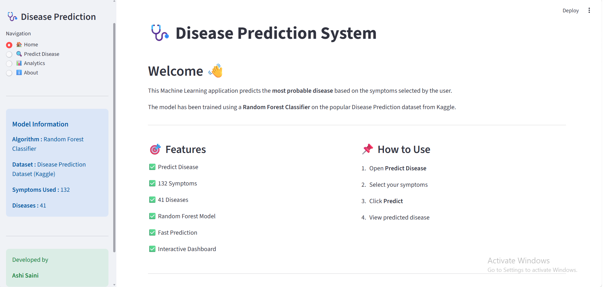
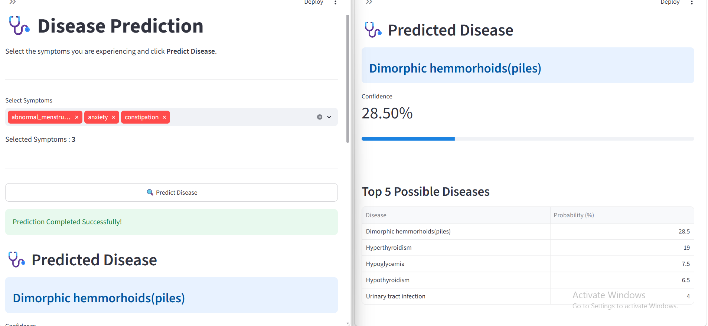
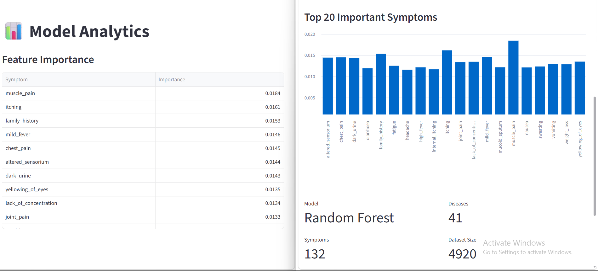

# 🩺 Disease Prediction System

A Machine Learning web application that predicts diseases based on symptoms using a Random Forest Classifier.

# Live Demo Link : https://ml-disease-prediction-system-ashi.streamlit.app/

## Features

- Predict diseases from symptoms
- Confidence Score
- Top 5 Predictions
- Feature Importance
- Interactive Dashboard
- Streamlit Web Application


## Application Screenshots

### Home Page



### Disease Prediction



### Analytics Dashboard




## Dataset

- Disease Prediction Dataset (Kaggle)
- 4920 Patient Records
- 132 Symptoms
- 41 Diseases

## Machine Learning

- Random Forest Classifier

## Technologies Used

- Python
- Pandas
- Scikit-Learn
- Streamlit
- Joblib

## Installation

```bash
pip install -r requirements.txt
```

Train Model

```bash
python train_model.py
```

Run App

```bash
python -m streamlit run app.py
```

## Project Structure

```
Disease_Prediction_System
│
├── dataset
├── models
├── images
├── train_model.py
├── app.py
├── README.md
└── requirements.txt
```

## Developer

**Ashi Saini**
